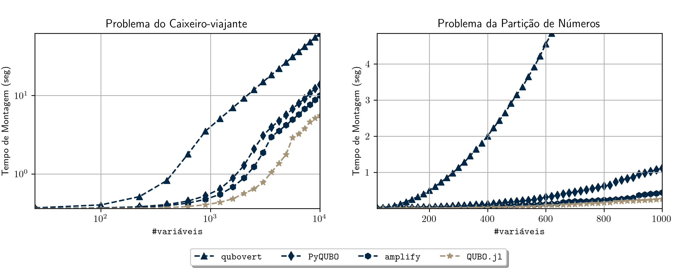

# ToQUBO-benchmark

Benchmarks for a paper on [QUBO.jl](https://github.com/psrenergy/QUBO.jl)

[](https://arxiv.org/abs/2307.02577)

[](/)

## How to reproduce the results

## Environment

| Linux  | Ubuntu 22.04   |
| :----: | :------------: |
| Python | CPython 3.10.6 |
| Julia  | julia 1.9.0    |

## Packages

| Package   | Version |
| :-------: | :-----: |
| ToQUBO.jl | v0.1.6  |
| PyQUBO    | v1.4.0  |
| OpenQAOA  | v0.1.3  |
| qubovert  | v1.2.5  |
| Qiskit    | v0.41.0 |
| amplify   | v0.11.1 |

## Instructions

First clone the repository

```shell
$ git clone https://github.com/psrenergy/ToQUBO-benchmark.git#master
...
```

To run the code and plot the results

```shell
$ cd ./ToQUBO-benchmark
...

$ make
```

You can also do this separately

```shell
$ cd ./ToQUBO-benchmark
...

$ make install
...

$ make run
...

$ make plot
...

```
