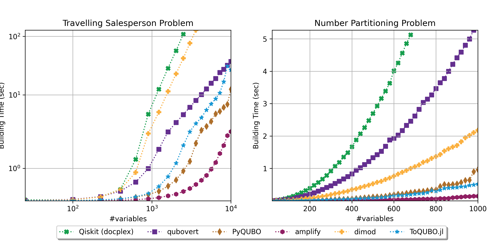

# ToQUBO-benchmark

Benchmarks for a paper on [QUBO.jl](https://github.com/JuliaQUBO/QUBO.jl)

[](https://arxiv.org/abs/2307.02577)

[](/)

## Archived paper results

The benchmark CSV files used for the paper are archived in
[`archive/paper-v1`](./archive/paper-v1). This baseline should stay fixed while
the top-level `benchmark/` and `data/` directories are modernized and rerun.

To redraw the paper plots from the archived CSV files:

```shell
$ make plot-paper
```

## Updating dependencies and results

Dependabot PRs should update dependency files only. They should not change
`archive/paper-v1`; the `verify` workflow checks that the archived files still
match their recorded hashes.

The top-level `benchmark/` and `data/` directories are the live benchmark
outputs. After merging dependency updates, rerun the benchmark intentionally
with the `toqubo-benchmark` workflow dispatch or a commit containing `[run]`.
The plot workflow will then redraw plots for the new live results.

If a future run needs to be preserved as another fixed reference point, add a new
archive directory such as `archive/modern-v1` instead of overwriting
`archive/paper-v1`.

## Current live result set

The top-level CSV files currently contain
`toqubo-0.5.2-python-3.10-openqaoa-2026-06-25`, a diagnostic rerun after
updating ToQUBO.jl to v0.5.2. OpenQAOA v0.2.6 is installed in an isolated
Python 3.10 venv because its published metapackage depends on an old Qiskit
plugin stack, while the Qiskit benchmark uses Qiskit v2.4.2. This run is not
archived as a paper-style fixed reference point.

The ToQUBO.jl benchmark uses `extract_qubo_backend` in
`benchmark/ToQUBO/problems.jl` to call the public `QUBOTools.backend(model)`
path added for ToQUBO-compiled JuMP models. This run uses registered releases:
ToQUBO.jl v0.5.2 and QUBOTools.jl v0.15.1. In the current TSP run, backend
extraction is 0.098 s of 2.026 s at 10,000 variables, so extraction is no
longer the dense TSP bottleneck. The 1,000-variable NPP row is 0.182 s, with
backend extraction below the printed CI-log precision.

The live run provenance, package versions, CSV row counts, and SHA-256 hashes
are recorded in [`data/report.json`](./data/report.json).

The environment table below describes this diagnostic WSL2 run only. A future
authoritative archived baseline should be produced from the documented CI
matrix or should record its exact environment before being compared with the
archived paper baseline.

## How to reproduce the results

## Environment

| Linux  | Linux 6.6.114.1 WSL2 / x86_64 |
| :----: | :----------------------------: |
| Python | CPython 3.10.19                |
| Julia  | julia version 1.12.6           |

## Packages

| Package             | Version |
| :-----------------: | :-----: |
| ToQUBO.jl           | v0.5.2  |
| QUBOTools.jl        | v0.15.1 |
| PyQUBO              | v1.5.0  |
| OpenQAOA            | v0.2.6  |
| Mitiq               | v0.47.0 |
| qubovert            | v1.2.5  |
| Qiskit              | v2.4.2  |
| qiskit-optimization | v0.7.0  |
| docplex             | v2.32.264 |
| amplify             | v1.6.1  |
| dimod               | v0.12.22 |

The main Python benchmark venv uses NumPy v2.2.6, the latest NumPy line
compatible with Python 3.10. The isolated OpenQAOA venv resolves OpenQAOA's
own stack, including Qiskit v0.46.3, NumPy v1.26.4, and docplex v2.25.236.

The live ToQUBO result CSVs also include `compiler_time` for the `optimize!`
step and `convert_time` for QUBOTools backend extraction. The `toqubo_time`
column remains their sum for compatibility with the existing plots.

## Instructions

First clone the repository

```shell
$ git clone https://github.com/JuliaQUBO/ToQUBO-benchmark.git
...
```

To run the code and plot the results

```shell
$ cd ./ToQUBO-benchmark
...

$ make
```

You can also do this separately

```shell
$ cd ./ToQUBO-benchmark
...

$ make install
...

$ make run
...

$ make report
...

$ make plot
...

```
