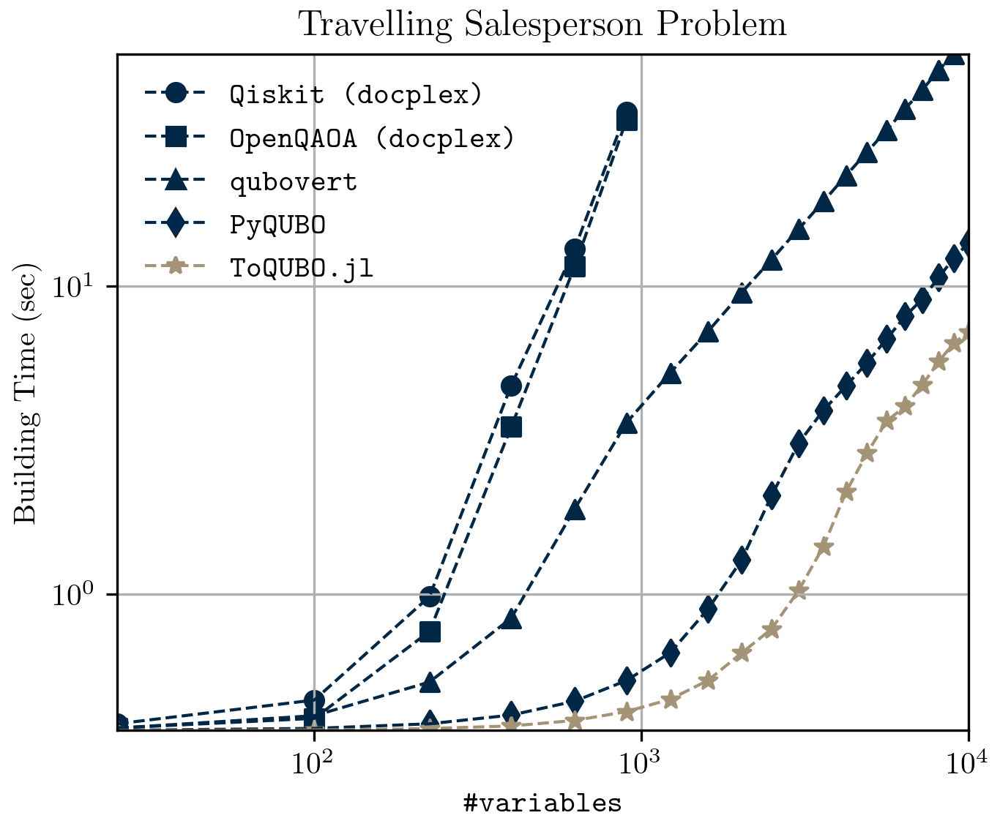
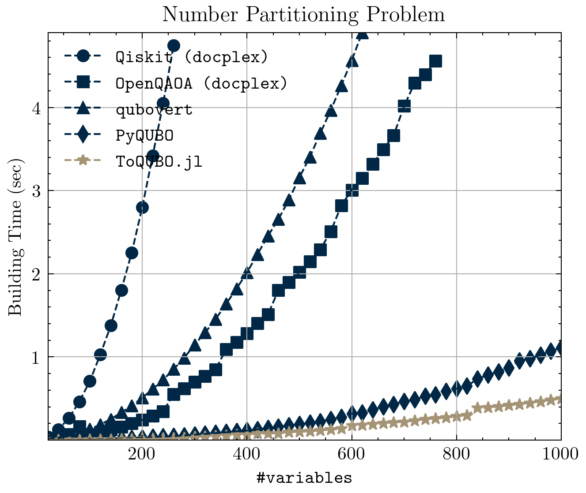

# ToQUBO-benchmark

Benchmarks for a paper on [ToQUBO.jl](https://github.com/psrenergy/ToQUBO.jl)

<div align="center">
    
    
</div>

## Setup
```
make install
```

## Run benchmark experiments

```
make run
```

### PyQUBO

PyQUBO is tested with two different versions(1.3.1 and 0.4.0), so you need to use two different environments:
### PyQUBO - latest
```ps
$ virtualenv benchmark\pyqubo
$ .\benchmark\pyqubo\Scripts\activate                 
$ pip install pyqubo==1.3.1
$ pip install pandas
$ python .\benchmark\pyqubo\tsp.py
``` 

### PyQUBO - 0.4.0
```ps
$ virtualenv benchmark\pyqubo_040
$ .\benchmark\pyqubo_040\Scripts\activate                 
$ pip install pyqubo==0.4.0
$ pip install pandas
$ python .\benchmark\pyqubo_040\tsp.py
``` 

To exit an environment run the following:
``` ps
$ deactivate
```

## Visualize benchmark results
The results are saved on `.csv` files, present in the folders for each experiment. To visualize them, do the following:
```
make plot
```
